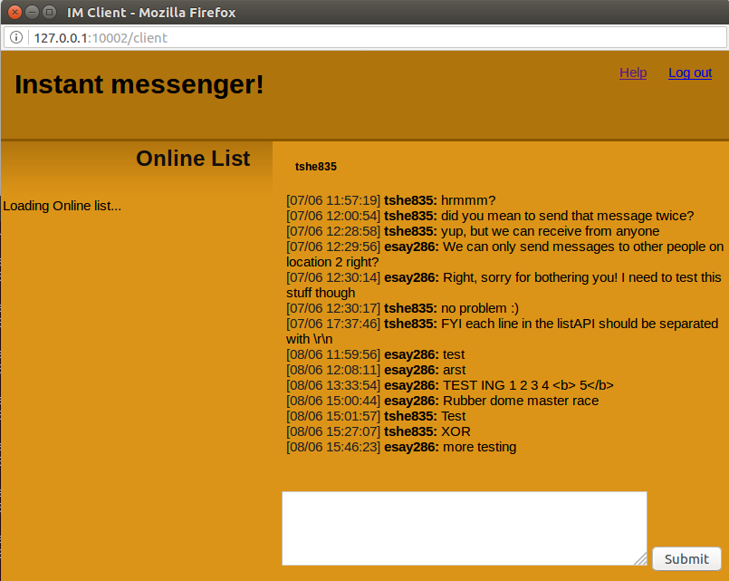

# Python Instant Messenger
**Note: This program relies on server that is currently offline :(**

Python/Web 2.0 Instant messenger I made for a uni project. Relies on a special server and communicates weirdly on top of the HTTP protocol, and uses an SQLite database to log messages.

Requires python 2.7 with cherrypy library. Tested on ubuntu.

## Screenshots:

Original readme below

* * *

Application made by Elliot Sayes (esay286)

Features:
- Logging in
- Sending/receiving messages (with XOR decryption)
- Online list with location code and user status icon
- Chat history (databases)
- Logging out
- Auto-updating page (jquery, ajax) - shows new messages and updated online list
- Threaded server interaction (jquery)
- Simultaneous sessions (per-recipient database structure, cherrypy session storage)
- receives messages when not logged in
- tested in chrome and firefox

To run: launch main.py
Log in at: http://127.0.0.1:10002/ with UPI and password!
client accessible by the pop-up window when logging in, or at http://127.0.0.1:10002/client (must be logged in first)
Log out by clicking the "Log out" button to exit the client, or at http://127.0.0.1:10002/logout

tested and working with tshe835, zcho308, bdre332
